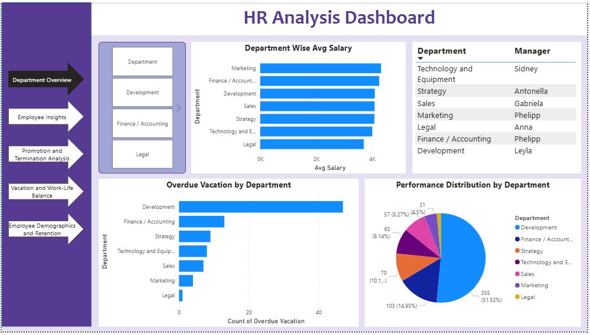
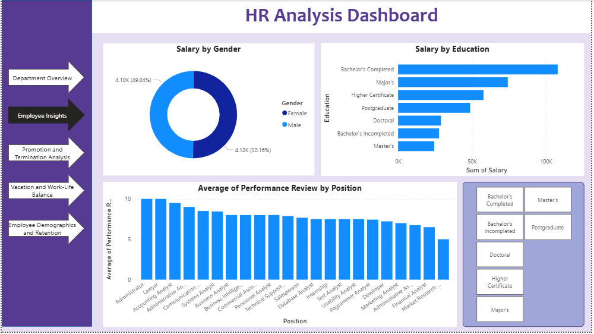
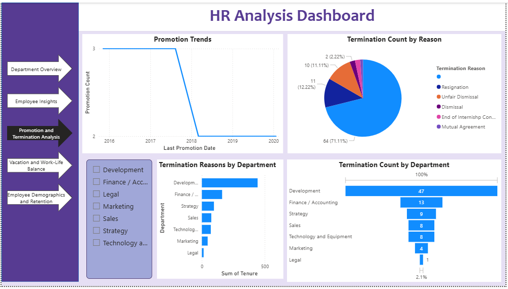
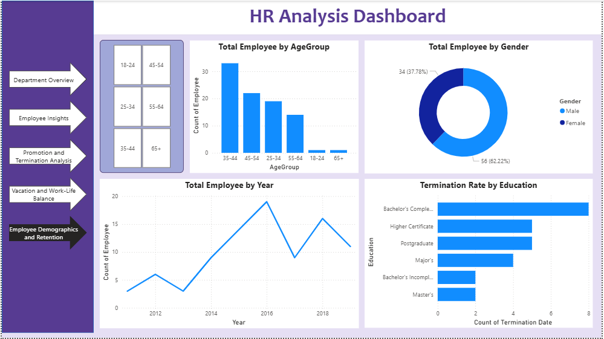

# 📊 HR Analytics Dashboard | Power BI

An interactive **HR Analytics Dashboard** built using **Power BI** to provide insights into employee performance, salary distribution, promotions, terminations, demographics, and work-life balance. This dashboard enables HR professionals and business leaders to make informed, data-driven decisions through interactive visualizations.

---

## 📌 Project Overview

This dashboard analyzes key HR metrics to help organizations understand their workforce and identify trends across departments. It provides a comprehensive view of employee demographics, performance, compensation, promotions, vacation usage, and retention.

---

## 🎯 Objectives

- Analyze employee demographics and workforce distribution.
- Compare department-wise salary trends.
- Evaluate employee performance across departments.
- Monitor promotion and termination trends.
- Analyze vacation and work-life balance.
- Support HR decision-making with interactive dashboards.

---

## 🛠️ Tools & Technologies

- **Power BI**
- **Power Query**
- **DAX (Data Analysis Expressions)**
- **Data Modeling**
- **Data Visualization**

---

## 📊 Dashboard Pages

### 1. Department Overview
Provides a high-level summary of department performance, including:
- Department-wise Average Salary
- Department Managers
- Overdue Vacation by Department
- Performance Distribution



---

### 2. Employee Insights
Displays employee-related insights such as:
- Salary Distribution by Gender
- Salary Distribution by Education
- Average Performance Rating by Position
- Education-wise Employee Analysis



---

### 3. Promotion & Termination Analysis
Tracks workforce changes with:
- Promotion Trends
- Termination Count by Department
- Termination Reasons
- Department-wise Termination Analysis



---

### 4. Vacation & Work-Life Balance
Analyzes employee leave and workplace distribution:
- Overdue Vacation by Department
- Overdue Vacation by City
- Employee Count by City
- Performance Review by City


---

### 5. Employee Demographics & Retention
Provides demographic and retention insights including:
- Employee Distribution by Age Group
- Employee Distribution by Gender
- Employee Hiring Trend
- Termination Rate by Education



---

## 📈 Key Insights

- Department-wise salary comparison
- Employee performance analysis
- Promotion and termination trends
- Workforce demographics
- Gender and education analysis
- Vacation utilization
- Employee retention insights

---

## 💼 Skills Demonstrated

- Interactive Dashboard Design
- Power BI Development
- Data Modeling
- Power Query
- DAX Measures
- HR Analytics
- Business Intelligence
- Data Visualization
- KPI Reporting

---

## 📂 Repository Structure

```
HR-Analytics-Dashboard/
│
├── HR Analysis.pbix
├── README.md
│
└── Screenshots/
    ├── 01_Department_Overview.png
    ├── 02_Employee_Insights.png
    ├── 03_Promotion_and_Termination_Analysis.png
    ├── 04_Vacation_and_WorkLife_Balance.png
    └── 05_Employee_Demographics_and_Retention.png
```

---

## 📝 Note

- The data used in this project is embedded within the **Power BI (.pbix)** file through **Power Query**.
- This repository contains the Power BI dashboard and screenshots for portfolio and learning purposes.
---

## 👩‍💻 Author

**Pushpanjali Patil**

If you found this project useful, feel free to ⭐ star this repository and connect with me on LinkedIn!
