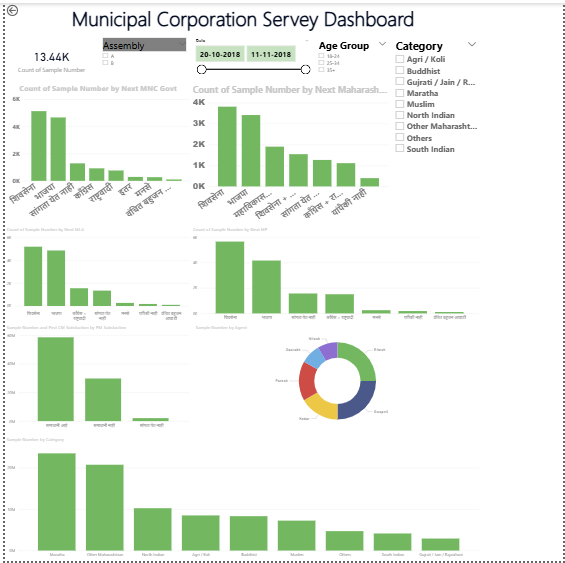

# Municipal Corporation Survey Analysis Dashboard

An interactive, single-page Power BI dashboard designed to analyze municipal corporation survey data, providing insights into voter preferences, leadership approval, demographic distribution, and regional political trends. This case study transforms large-scale public opinion data into an intuitive analytical dashboard, enabling researchers, analysts, and decision-makers to explore survey results through dynamic visualizations.

---

## 📊 Dashboard Preview



---

## 🎯 Business Objective

The objective of this dashboard is to analyze municipal corporation survey responses to identify:

- Regional voting preferences
- Leadership approval levels
- Demographic representation
- Political party performance
- Survey field operations

The dashboard helps stakeholders make data-driven decisions by presenting complex survey information through interactive and visually engaging reports.

---

## 📌 Dashboard Highlights

- **13.44K** Survey Responses Analyzed
- Regional Voting Preference Analysis
- Leadership Approval Ratings
- Demographic & Community Distribution
- Assembly & Parliamentary Trends
- Survey Agent Performance Monitoring
- Interactive Filtering & Cross-Visual Analysis

---

## 🚀 Key Features & Visual Insights

### 🗳️ Regional Voting Preferences

Analyze public voting intentions across multiple political levels.

**Key Insights:**

- **Next MNC Government:** Visualizes party-wise voter preferences where **Shivsena (शिवसेना)** and **BJP (भाजपा)** receive the highest support, followed by **Congress (काँग्रेस)**, **NCP (राष्ट्रवादी)**, **MNS (मनसे)**, and **Vanchit Bahujan Aghadi (वंचित बहुजन आघाडी)**.
- **Next Maharashtra Government:** Displays voting preferences for state government formation.
- **Next MP & Next MLA:** Compares parliamentary and legislative assembly voting trends.
- **Alliance Preference:** Highlights public support for political alliances such as **Mahavikas Aghadi (महाविकास आघाडी)**.

---

### 👤 Leadership Approval Analysis

Evaluate public satisfaction with current leadership.

The dashboard categorizes responses into:

- **समाधानी आहे (Satisfied)** – Majority of respondents expressing positive leadership approval.
- **समाधानी नाही (Dissatisfied)** – Respondents indicating dissatisfaction.
- **सांगता येत नाही (Undecided)** – Neutral or swing voters whose opinions remain undecided.

---

### 👥 Demographic & Community Analysis

Understand survey participation across various communities.

**Major Respondent Groups**

- Maratha
- Other Maharashtrian
- North Indian

Additional demographic groups include:

- Agri / Koli
- Buddhist
- Muslim
- South Indian
- Gujrati / Jain / Rajasthani

This analysis provides a comprehensive representation of survey respondents across social groups.

---

### 📈 Survey Field Operations

Monitor field survey performance using an interactive donut chart.

Survey responses are distributed among field agents including:

- Nilesh
- Hitesh
- Swapnil
- Kedar
- Paresh
- Saurabh

This visualization helps evaluate survey collection efforts across different regions.

---

## 🎯 Dashboard Interactivity

The dashboard includes interactive features such as:

- Dynamic slicers for filtering survey responses
- Cross-filtering across all visuals
- Interactive charts for deeper analysis
- Responsive report layout for efficient exploration

---

## 🛠️ Tech Stack

| Category | Tools |
|----------|-------|
| BI Tool | Power BI Desktop |
| Data Preparation | Power Query |
| Data Modeling | Power BI Data Model |
| Calculations | DAX |
| Visualization | Interactive Charts & KPIs |
| Localization | English + Marathi Multilingual Support |

---

## 💡 Skills Demonstrated

- Data Cleaning
- Data Transformation
- Data Modeling
- DAX Calculations
- Interactive Dashboard Design
- Survey Data Analysis
- Political Trend Analysis
- Demographic Analysis
- Data Visualization
- Business Intelligence Reporting

---

## 📂 Folder Structure

```text
PowerBI-Data-Analytics-Portfolio/
├── Amazon-Prime-Video-Analytics/
├── College-Analysis-Dashboard/
├── Corporate-Sales-Performance-Dashboard/
├── Employee-Attrition-Dashboard/
├── HR-Analytics-Dashboard/
├── Job-Market-Analysis-Dashboard/
├── Municipal-Corporation-Survey-Dashboard/
│   ├── Municipal-Corporation-Survey-Dashboard.pbix
│   ├── README.md
│   └── survey_dashboard.png
├── PwC-Call-Center-Solution-Dashboard/
├── PwC-Customer-Retention-Dashboard/
├── PwC-Diversity-Inclusion-Dashboard/
├── Student-Depression-Analysis-Dashboard/
└── Supermarket-Sales-Dashboard/
```

---

## 📖 Conclusion

The Municipal Corporation Survey Analysis Dashboard transforms over **13.44K survey responses** into meaningful insights through interactive Power BI visualizations. It enables users to analyze voter preferences, leadership approval, demographic distribution, political trends, and field survey operations within a single reporting interface.

This project demonstrates practical expertise in **Power BI**, **Power Query**, **DAX**, **data modeling**, and **interactive dashboard development**, making it a valuable addition to a professional data analytics portfolio.

---

### ⭐ If you found this project useful, consider giving it a star on GitHub!
