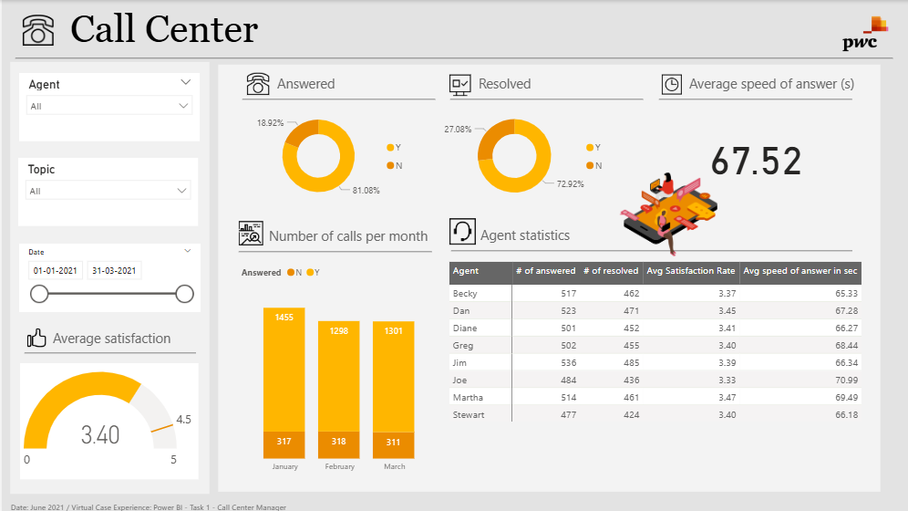

# 📞 PwC Call Center Performance Analytics Dashboard

An interactive single-page Power BI dashboard developed as part of the **PwC Virtual Case Experience**. This project analyzes call center operations by evaluating customer service performance, agent productivity, call resolution efficiency, and customer satisfaction. The dashboard provides actionable insights that help managers monitor service quality, improve operational efficiency, and enhance customer experience.

---

## 📊 Dashboard Preview



---

## 🎯 Project Objectives

- Monitor key call center performance indicators.
- Analyze answered and abandoned call rates.
- Evaluate customer satisfaction levels.
- Measure call resolution efficiency.
- Compare agent performance across multiple KPIs.
- Support managers in improving customer service operations.

---

## 📊 Dashboard Features

### 1. Performance Overview

Provides a high-level summary of call center performance through KPI cards.

**Key Metrics**

- **Average Speed of Answer:** **67.52 seconds**
- **Average Satisfaction Rating:** **3.40 / 5**
- **Analysis Period:** **01-Jan-2021 to 31-Mar-2021**

---

### 2. Call Performance Analysis

**Dashboard Highlights**

- Answered vs. Abandoned calls
- Resolved vs. Unresolved calls
- Overall service efficiency

**Key Findings**

- **Answered Calls:** **81.08%**
- **Abandoned Calls:** **18.92%**
- **Resolved Calls:** **72.92%**
- **Unresolved Calls:** **27.08%**

---

### 3. Monthly Call Trends

**Dashboard Highlights**

- Monthly answered and missed calls
- Traffic comparison across Q1
- Operational workload analysis

**Monthly Performance**

| Month | Answered | Missed |
|--------|---------:|-------:|
| January | 1,455 | 317 |
| February | 1,298 | 318 |
| March | 1,301 | 311 |

---

### 4. Agent Performance Analysis

**Dashboard Highlights**

- Agent-wise call handling performance
- Resolution comparison
- Customer satisfaction ratings
- Average speed of answer

**Top Performers**

- **Dan:** 523 answered calls, 471 resolved calls
- **Jim:** 536 answered calls, 485 resolved calls
- **Martha:** Highest customer satisfaction rating (**3.47**)
- **Becky:** Fastest average speed of answer (**65.33 seconds**)

---

## 📈 Key Insights

- More than **81%** of incoming calls were successfully answered.
- Nearly **73%** of customer issues were resolved during interactions.
- Customer satisfaction averaged **3.40 out of 5**.
- Dan and Jim handled the highest number of customer calls.
- Martha achieved the highest customer satisfaction rating.
- Becky demonstrated the fastest response time among high-volume agents.
- Interactive filtering enables managers to monitor performance across different time periods.

---

## 🛠️ Tech Stack

- **Visualization Tool:** Power BI Desktop
- **Data Transformation:** Power Query
- **Data Analysis:** DAX (Data Analysis Expressions)
- **Visualizations:** KPI Cards, Donut Charts, Bar Charts, Gauge Chart, Matrix Tables, Slicers
- **Project Context:** PwC Virtual Case Experience – Call Center Manager
- **Dashboard Design:** Interactive operational dashboard with cross-filtering and dynamic visualizations

---

## ✨ Features

- Interactive KPI dashboard
- Agent performance analysis
- Customer satisfaction monitoring
- Call resolution tracking
- Monthly call trend analysis
- Answered vs. abandoned call analysis
- Dynamic filtering
- Executive operational reporting

---

## 🚀 Future Enhancements

- Real-time call center monitoring.
- Predictive call volume forecasting.
- Agent productivity scorecards.
- SLA compliance analysis.
- AI-powered customer sentiment analysis.
- Interactive drill-through reports.

---

## 📂 Folder Structure

```text
PowerBI-Data-Analytics-Portfolio/
├── Amazon-Prime-Video-Analytics/
├── College-Analysis-Dashboard/
├── Corporate-Sales-Performance-Dashboard/
├── Employee-Attrition-Dashboard/
├── HR-Analytics-Dashboard/
├── Job-Market-Analysis-Dashboard/
├── PwC-Call-Center-Solution-Dashboard/
│   ├── README.md
│   ├── Call Center Solution.pbix
│   └── dashboard_preview.png          # Dashboard preview image
├── PwC-Customer-Retention-Dashboard/
├── PwC-Diversity-Inclusion-Dashboard/
├── Student-Depression-Analysis-Dashboard/
└── Supermarket-Sales-Dashboard/
```

---

## 📌 Conclusion

This Power BI dashboard provides a comprehensive analysis of call center operations by combining customer service KPIs, call handling metrics, agent performance, and customer satisfaction into a single interactive business intelligence solution. It enables managers to evaluate operational efficiency, improve service quality, and make data-driven decisions that enhance the overall customer experience.
