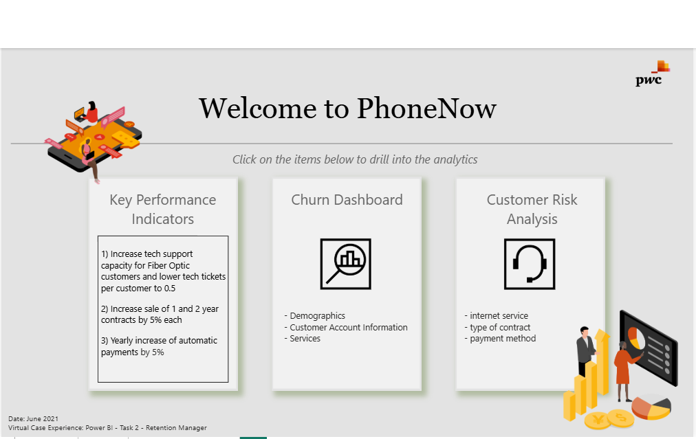
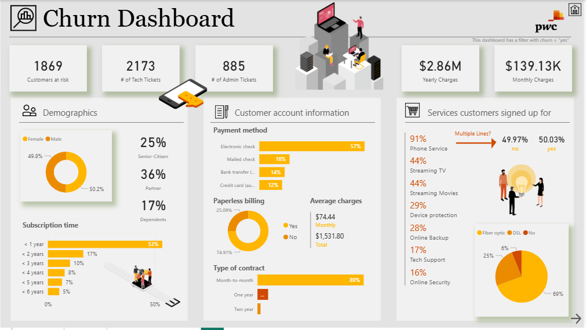
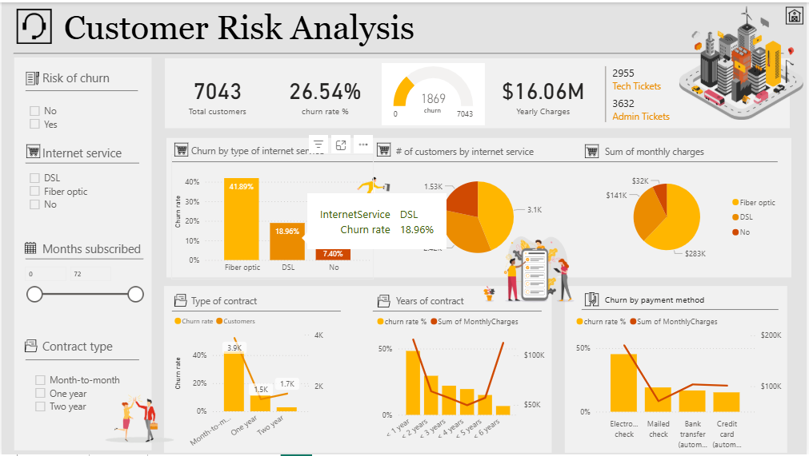

# 📞 PwC Customer Retention & Churn Analytics Dashboard

An interactive three-page Power BI dashboard developed as part of the **PwC Virtual Case Experience**. This project analyzes customer retention, churn behavior, service usage, and payment patterns for the fictional telecom company **PhoneNow**. The dashboard provides actionable insights that help identify high-risk customers, understand churn drivers, and support data-driven customer retention strategies.

---

## 📊 Dashboard Previews

### Page 1 – Welcome Portal


---

### Page 2 – Churn Dashboard


---

### Page 3 – Customer Risk Analysis


---

## 🎯 Project Objectives

- Analyze customer churn patterns.
- Identify high-risk customer segments.
- Evaluate contract types and payment methods affecting churn.
- Analyze customer demographics and service usage.
- Monitor revenue impact caused by customer attrition.
- Support retention managers in reducing customer churn.

---

## 📊 Dashboard Features

## 📋 Page 1 – Welcome Portal

Acts as the central navigation hub for the report.

**Dashboard Highlights**

- Interactive navigation buttons
- Quick access to:
  - Churn Dashboard
  - Customer Risk Analysis Dashboard
- User-friendly corporate interface

---

## 📋 Page 2 – Churn Dashboard

Provides detailed insights into customers who have already churned.

### Customer Churn Overview

**Key Metrics**

- Customers Churned: **1,869**
- Tech Support Tickets: **2,173**
- Admin Tickets: **885**
- Annual Charges Lost: **$2.86M**
- Monthly Charges: **$139.13K**

---

### Customer Demographics

**Dashboard Highlights**

- Gender distribution
- Senior citizen analysis
- Churn comparison across customer groups

**Key Findings**

- Male: **50.2%**
- Female: **49.8%**
- Senior Citizens: **25%**

---

### Contract & Tenure Analysis

**Dashboard Highlights**

- Customer tenure distribution
- Contract type comparison
- Monthly versus long-term contracts

**Key Findings**

- **53%** of churn occurs within the first year.
- **89%** of churned customers had month-to-month contracts.

---

### Payment & Internet Service Analysis

**Dashboard Highlights**

- Payment method comparison
- Internet service comparison
- Service type contribution to churn

**Key Findings**

- Electronic Check contributed **57%** of churn.
- Fiber Optic customers accounted for **69%** of customer churn.

---

## 📋 Page 3 – Customer Risk Analysis

Provides a complete overview of the telecom customer base.

### Customer Overview

**Key Metrics**

- Total Customers: **7,043**
- Overall Churn Rate: **26.54%**
- Total Annual Revenue: **$16.06M**

---

### Service Risk Analysis

**Dashboard Highlights**

- Churn rate by internet service
- Revenue contribution by service type
- Customer risk segmentation

**Key Findings**

- Fiber Optic customers have the highest churn rate at **41.89%**.

---

### Contract & Payment Risk

**Dashboard Highlights**

- Contract duration comparison
- Payment method analysis
- Churn risk by billing method

**Key Findings**

- Electronic Check customers showed the highest churn.
- One-year and two-year contracts significantly reduced churn compared to month-to-month contracts.

---

## 📈 Key Insights

- The company experienced an overall churn rate of **26.54%**.
- Nearly half of all churn occurred during the first year of customer tenure.
- Month-to-month contracts were strongly associated with customer churn.
- Electronic Check was the highest-risk payment method.
- Fiber Optic customers exhibited the highest churn probability.
- Long-term contracts demonstrated significantly better customer retention.
- Interactive dashboards enable detailed customer segmentation and risk analysis.

---

## 🛠️ Tech Stack

- **Visualization Tool:** Power BI Desktop
- **Data Transformation:** Power Query
- **Data Analysis:** DAX (Data Analysis Expressions)
- **Visualizations:** KPI Cards, Donut Charts, Bar Charts, Line Charts, Matrix Tables, Slicers
- **Project Context:** PwC Virtual Case Experience – Customer Retention Manager
- **Dashboard Design:** Interactive multi-page dashboard with navigation buttons, cross-filtering, and drill-through functionality

---

## ✨ Features

- Three-page interactive dashboard
- Customer churn analysis
- Customer demographic insights
- Revenue impact analysis
- Contract type analysis
- Payment method analysis
- Internet service analysis
- Customer risk profiling
- Interactive navigation
- Executive business reporting

---

## 🚀 Future Enhancements

- Machine Learning-based churn prediction.
- Customer lifetime value (CLV) analysis.
- Customer segmentation using RFM analysis.
- Personalized retention strategy recommendations.
- Real-time telecom customer monitoring.
- Interactive drill-through reports.

---

## 📂 Folder Structure

```text
PowerBI-Data-Analytics-Portfolio/
├── Amazon-Prime-Video-Analytics/
├── College-Analysis-Dashboard/
├── Corporate-Sales-Performance-Dashboard/
├── Employee-Attrition-Dashboard/
├── HR-Analytics-Dashboard/
├── Job-Market-Analysis-Dashboard/
├── PwC-Customer-Retention-Dashboard/
│   ├── README.md
│   ├── Customer Retention.pbix
│   ├── welcome_page.png          # Welcome dashboard preview
│   ├── churn_page.png            # Churn dashboard preview
│   └── risk_page.png             # Customer risk dashboard preview
├── PwC-Diversity-Inclusion-Dashboard/
├── Student-Depression-Analysis-Dashboard/
└── Supermarket-Sales-Dashboard/
```

---

## 📌 Conclusion

This Power BI dashboard provides a comprehensive analysis of customer retention by combining churn metrics, customer demographics, service usage, payment methods, contract details, and revenue analysis into an interactive business intelligence solution. It enables telecom managers to identify churn drivers, evaluate customer risk, and implement data-driven retention strategies that improve customer satisfaction and long-term business performance.
