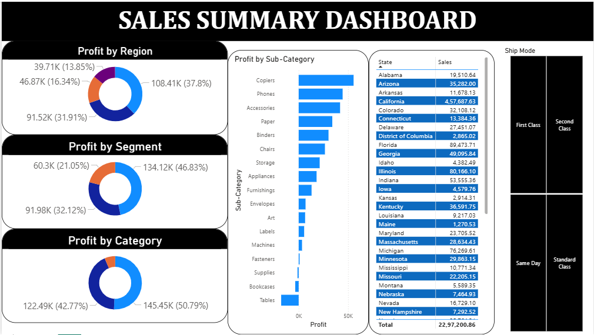

# Case Study: Sales Summary Dashboard

An interactive, single-page Power BI dashboard designed to analyze corporate sales performance and profitability metrics. This case study processes transactional retail data to uncover profit distributions across geographic regions, customer segments, product categories, and shipping logistics.

---

## 📊 Dashboard Preview



---

## 🚀 Key Features & Detailed Visual Insights

This executive dashboard consolidates critical retail operations and financial KPIs into a single high-impact reporting layout:

### 📈 Profitability Breakdowns
*   **Profit by Region:** Identifies the highest-performing geographical territories, led by the top region contributing **$108.41K (37.8%)** to overall profits.
*   **Profit by Segment:** Tracks earnings across business consumer classifications, with the primary segment driving **$134.12K (46.83%)** of the profit share.
*   **Profit by Category:** Evaluates the primary high-level product divisions (e.g., Technology, Office Supplies, Furniture), led by the top category at **$145.45K (50.79%)**.

### 📦 Product & Logistics Analysis
*   **Sub-Category Profitability:** A horizontal bar chart mapping specific product lines. It highlights high-margin drivers like **Copiers** and **Phones**, while identifying underperforming or negative-margin lines like **Tables** and **Bookcases**.
*   **Geographic Sales Grid:** A detailed tabular view tracking state-level distribution (e.g., California leading with **$4,57,687.63** in sales) out of a grand total of **$22,97,200.86** in sales.
*   **Ship Mode Slicers:** Interactive selectors to dynamically filter performance based on shipping priorities: *First Class*, *Second Class*, *Same Day*, and *Standard Class*.

---

## 🛠️ Tech Stack & Tools

*   **BI Tool:** Power BI Desktop
*   **Dataset:** Corporate Transactional Sales & Profit Data
*   **Design & Theme:** Clean, high-contrast dark header blocks, nested container cards, and intuitive color coding for easy stakeholder scanning.

---

## 📂 Folder Structure

This project lives in its own dedicated workspace within my portfolio:
```text
PowerBI-Data-Analytics-Portfolio/
├── Amazon-Prime-Video-Analytics/
├── College-Analysis-Dashboard/
├── Corporate-Sales-Performance-Dashboard/
├── Employee Attrition Dashboard/
├── HR-Analytics-Dashboard/
├── Job Market Analysis Dashboard/
├── Municipal-Corporation-Survey-Dashboard/
├── PwC-Call-Center-Solution-Dashboard/
├── PwC-Customer-Retention-Dashboard/
├── PwC-Diversity-Inclusion-Dashboard/
├── Sales-Summary-Dashboard/             # This new project folder
│   ├── Case Study -Sales Summary Dashboard on Power BI.pbix
│   ├── README.md
│   └── sales_summary_dashboard.png
├── Student Depression Analysis Dashboard/
└── Supermarket-Sales-Dashboard/
